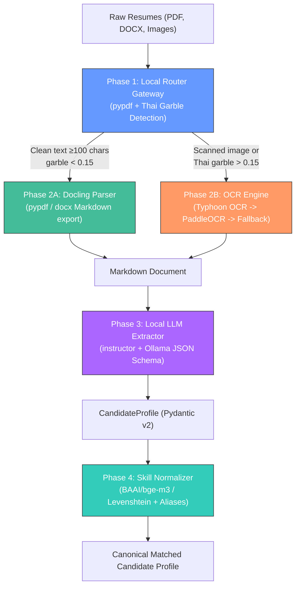

# 🐶 DUMB-DOG-AI: Air-Gapped AI Resume Parsing & Candidate Matching Pipeline

A production-ready, fully self-hosted, air-gapped AI Resume Parsing and Candidate Matching Pipeline with **ZERO external cloud APIs**. All parsers, OCR engines, local LLMs, skill normalizers, and benchmarking suites run 100% locally on user hardware.

---

## 🏗️ Architecture Overview



---

## ⚡ Pipeline Modules

### 1. Phase 1: Local File Routing Gateway (`parsers/router.py`)
- Automatically identifies file types (`PDF`, `DOCX`, `IMAGE`).
- Implements a **3-signal Thai garble test**:
  1. **Detached Thai combining vowel/tone marks** (`\u0e31`, `\u0e34-\u0e3a`, `\u0e47-\u0e4e` preceded by spaces or non-consonants).
  2. **Unicode replacement characters** (`\ufffd` or control characters).
  3. **Whitespace fragmentation** (single-character word clusters common in broken font encodings).
- Routes digital PDFs with clean text to Docling and broken/scanned documents to OCR.
- **Unit Tests**: 9/9 tests pass in `tests/test_router.py`.

### 2. OCR Benchmark Suite (`ocr_benchmark.py`)
- Direct benchmark comparing:
  - **pypdf**: Instant baseline text extraction (100% recall on digital PDFs, ~3ms).
  - **PaddleOCR**: Traditional OCR engine (`th_PP-OCRv5_mobile_rec`).
  - **Typhoon OCR**: Vision-Language Model by SCB 10X running locally via Ollama (`scb10x/typhoon-ocr-3b`), purpose-built for complex Thai document structures.
- Includes synthetic and real-world bilingual sample resumes.

### 3. Phase 2: Offline Document Parsing (`parsers/`)
- **`docling_parser.py`**: Docling `DocumentConverter` with fallback to `pypdf` and `python-docx` for Markdown export.
- **`ocr_engine.py`**: Multi-tiered OCR fallback (Typhoon OCR via local Ollama → PaddleOCR → fallback).

### 4. Phase 3: Structured Local LLM Extraction (`extraction/llm_local.py`)
- Uses `instructor` with Ollama's local OpenAI-compatible endpoint (`http://localhost:11434/v1`).
- Enforces strict JSON Schema validation into Pydantic v2 models:
  - `CandidateProfile`, `WorkExperience`, `Education`.
- Features an automated multi-model fallback chain (`qwen2.5:7b` → `llama3.1:8b` → `mistral:7b`) with retry logic.

### 5. Phase 4: Offline Semantic Skill Normalization (`matching/bge_matcher.py`)
- 40+ canonical tech and leadership skills across languages, frameworks, cloud, data, and soft skills.
- Pre-mapped tech acronyms (`k8s` → `Kubernetes`, `ml` → `Machine Learning`) and Thai translations (`การจัดการโครงการ` → `Project Management`).
- Cosine similarity matching using `BAAI/bge-m3` embeddings (CPU/GPU auto-detection) with Levenshtein fuzzy string matching fallback.

### 6. Phase 5: ExtractBench Benchmarking Suite (`eval/`)
- Ground truth test cases for English, Thai, and Bilingual resumes (`eval/test_data.py`).
- Automated scoring of:
  - Schema validity rate
  - Average extraction latency
  - Precision, Recall, and F1 score for extracted skills
- Supports both live Ollama benchmarks and `--mock` offline dry-runs (`eval/benchmark.py`).

---

## 🚀 Quickstart

### Prerequisites
- Python 3.11+
- Local Ollama instance (for LLM inference & Typhoon OCR):
  ```bash
  ollama serve
  ollama pull qwen2.5:7b
  ollama pull scb10x/typhoon-ocr-3b
  ```

### Installation
```bash
git clone https://github.com/thanaboon8759/DUMB-DOG-AI.git
cd DUMB-DOG-AI
pip install -r requirements.txt
```

---

## 💻 CLI Usage

### 1. Route Resumes
```bash
# Route individual files
python main.py resume.pdf scan.png

# Scan and route entire folder
python main.py --dir ./benchmark_data/
```

### 2. Run End-to-End Extraction
```bash
# Route -> Parse (Docling/OCR) -> Local LLM Extraction
python main.py benchmark_data/english_resume.pdf --extract --model qwen2.5:7b
```

### 3. Normalize Skills
```bash
python matching/bge_matcher.py
```

### 4. Run Model Benchmark (ExtractBench)
```bash
# Offline dry-run
python -m eval.benchmark --mock

# Live local LLM evaluation
python -m eval.benchmark
```

### 5. Run Unit Tests
```bash
python -m tests.test_router
```

---

## 🔒 Privacy & Air-Gap Guarantee
- **Zero Cloud APIs**: No OpenAI, Anthropic, Google Cloud, or third-party web endpoints.
- **Air-Gapped Operation**: Runs completely disconnected from the Internet once models and packages are downloaded.
- **Data Confidentiality**: Resumes and candidate personally identifiable information (PII) never leave user hardware.

---

## 📄 License
MIT License.
