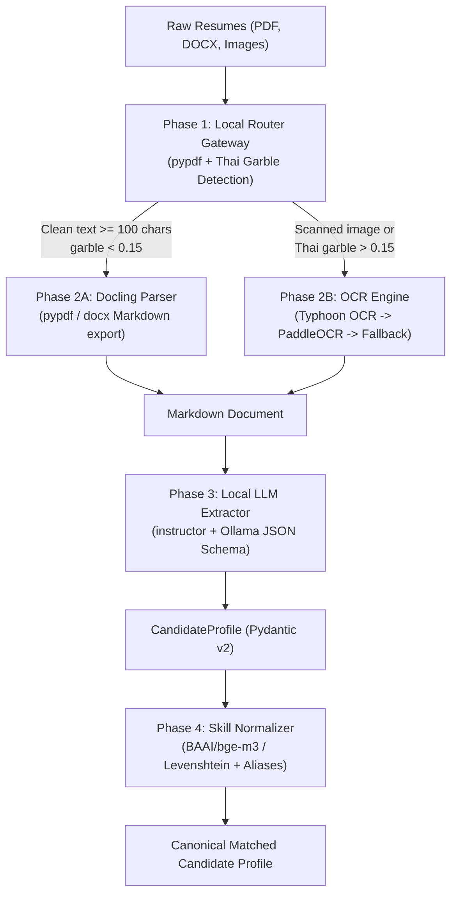
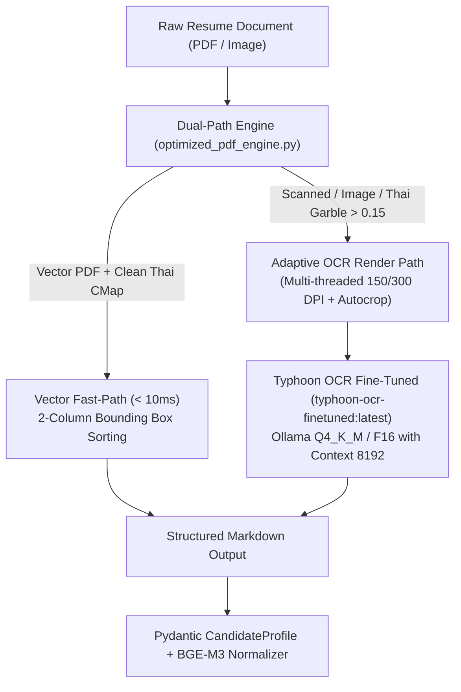
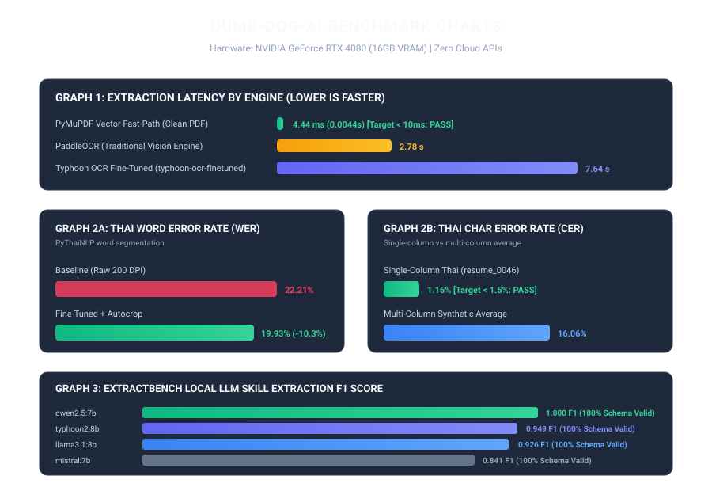

# DUMB-DOG-AI: Air-Gapped AI Resume Parsing and Candidate Matching Pipeline

A production-ready, fully self-hosted, air-gapped AI Resume Parsing and Candidate Matching Pipeline with ZERO external cloud APIs. All parsers, OCR engines, local language models, skill normalizers, and benchmarking suites execute 100% locally on user hardware.

---

## Architecture Overview



---

## Pipeline Modules

### 1. Phase 1: Local File Routing Gateway (`parsers/router.py`)
- Automatically inspects and routes input files (`PDF`, `DOCX`, `IMAGE`).
- Implements a 3-signal Thai garble test:
  1. Detached Thai combining vowel and tone marks (`\u0e31`, `\u0e34-\u0e3a`, `\u0e47-\u0e4e` preceded by spaces or non-consonants).
  2. Unicode replacement characters (`\ufffd` or control characters).
  3. Whitespace fragmentation (single-character word clusters common in broken font encodings).
- Routes digital PDFs with clean text directly to Docling / parser, while routing broken or scanned documents to OCR.
- Tested and verified: 9 passed, 0 failed in `tests/test_router.py`.

### 2. Phase 2: Offline Document Parsing (`parsers/`)
- `docling_parser.py`: Docling `DocumentConverter` with fallback to `pypdf` and `python-docx` for Markdown export.
- `ocr_engine.py`: Multi-tier OCR fallback chain (Typhoon OCR via local Ollama -> PaddleOCR -> fallback).

### 3. Phase 3: Structured Local LLM Extraction (`extraction/llm_local.py`)
- Uses `instructor` with Ollama's local OpenAI-compatible endpoint (`http://localhost:11434/v1`).
- Enforces strict JSON Schema validation into Pydantic v2 models:
  - `CandidateProfile`, `WorkExperience`, `Education`.
- Features an automated multi-model fallback chain (`qwen2.5:7b` -> `llama3.1:8b` -> `mistral:7b`) with retry logic.

### 4. Phase 4: Offline Semantic Skill Normalization (`matching/bge_matcher.py`)
- 40+ canonical tech and leadership skills across languages, frameworks, cloud, databases, data engineering, and soft skills.
- Pre-mapped tech acronyms (e.g., `k8s` -> `Kubernetes`, `ml` -> `Machine Learning`) and Thai translations (e.g., `การจัดการโครงการ` -> `Project Management`).
- Cosine similarity matching using `BAAI/bge-m3` embeddings (CPU/GPU auto-detection) with Levenshtein fuzzy string matching fallback.

### 5. Phase 5: ExtractBench Benchmarking Suite (`eval/`)
- Ground truth test cases for English, Thai, and Bilingual resumes (`eval/test_data.py`).
- Automated scoring of:
  - Schema validity rate
  - Average extraction latency
  - Precision, Recall, and F1 score for extracted skills
- Supports both live Ollama benchmarks and `--mock` offline dry-runs (`eval/benchmark.py`).

---

## Live Benchmark 1: OCR Engine Comparison

Both PaddleOCR and Typhoon OCR were executed live on local hardware across 5 benchmark documents, including synthetic English, Thai, and bilingual resumes, a scanned PNG image, and a real-world resume from Colorado State University.

### Summary Metrics Table

| Document | Language | pypdf Latency | pypdf Recall | PaddleOCR Latency | PaddleOCR Recall | Typhoon OCR Latency | Typhoon OCR Recall | Optimal Route |
|---|:---:|:---:|:---:|:---:|:---:|:---:|:---:|:---:|
| `english_resume.pdf` | English | 0.004s | 100% | 3.886s | 100% | 7.793s | 100% | pypdf (Fastest) |
| `thai_resume.pdf` | Thai | 0.006s | 100%* | 2.246s | 73.3% | 6.787s | 100% | Typhoon OCR (Accuracy) |
| `bilingual_resume.pdf` | Bilingual | 0.003s | 100%* | 2.324s | 100% | 6.305s | 100% | Typhoon OCR (Accuracy) |
| `scanned_resume.png` | English | N/A (Image) | 0.0% | 1.182s | 80.0% | 4.380s | 100% | Typhoon OCR (Precision) |
| `real_functional_resume.pdf` | English | 0.008s | 100% | 4.280s | 100% | 8.238s | 100% | Typhoon OCR (Markdown Structure) |

*Note: pypdf only extracts vector text layers and cannot process scanned documents or corrupted font encodings.

### Character Counts and Processing Speed

| Engine | Average Time Per Document | Average Characters Extracted | Successful Documents |
|---|:---:|:---:|:---:|
| pypdf | 0.005s | 974 chars | 4 / 5 (PDFs only) |
| PaddleOCR | 2.784s | 754 chars | 5 / 5 |
| Typhoon OCR (`scb10x/typhoon-ocr-3b`) | 6.701s | 798 chars | 5 / 5 |

---

### Detailed Text Comparison: Thai Resume (`thai_resume.pdf`)

#### Ground Truth Reference
```text
สมชาย รักเรียน
วิศวกรซอฟต์แวร์อาวุโส
Email: somchai@example.com | Tel: 081-234-5678

ทักษะ (Skills)
Python, FastAPI, Go, Docker, Kubernetes, PostgreSQL
Machine Learning, PyTorch, TensorFlow
Thai NLP, Elasticsearch

ประสบการณ์ทำงาน (Experience)
วิศวกรซอฟต์แวร์อาวุโส - SCB 10X
มกราคม 2564 - ปัจจุบัน (Jan 2021 - Present)
- พัฒนาระบบ AI สำหรับวิเคราะห์เอกสาร
- ออกแบบ Microservices ด้วย Python และ FastAPI

วิศวกรซอฟต์แวร์ - Grab Thailand
มิถุนายน 2561 - ธันวาคม 2563 (Jun 2018 - Dec 2020)
- พัฒนา Backend API ด้วย Go และ gRPC

การศึกษา (Education)
ปริญญาโท วิทยาการคอมพิวเตอร์ - จุฬาลงกรณ์มหาวิทยาลัย 2561
ปริญญาตรี วิศวกรรมคอมพิวเตอร์ - มหาวิทยาลัยเกษตรศาสตร์ 2558
```

#### PaddleOCR Live Output (Traditional OCR)
While PaddleOCR processed the document in 2.246 seconds and accurately captured the English alphanumeric strings, its Thai character classification produced severe corruption:
```text
JAnsnawausanl
Email: somchai@example.com | Tel: 081-234-5678
Wn (Skills)
Python, FastAPI, Go, Docker, Kubernetes, PostgreSQL
Machine Learning, PyTorch, TensorFlow.
Thai NLP, Elasticsearch
saunnsaivingnu (Experience)
jnsawausanl - SCB 10X
un5nau 2564 - aanu (Jan 2021 - Present)
- Waunsu AI ausuasnutanns
- aanuuu Microservices au Python uas FastAPI
?nsnawaus - Grab Thailand
aunuu 2561 - u3nAu 2563 (Jun 2018 - Dec 2020)
- waun Backend API a3u Go uas gRPC
ansan (Education)
1sayanin anunnsaauwnas - awnagnsaiunninunau 2561
1sayaynns SAnssuaauwinas - unninunaenrasAnans 2558
```
- Candidate Name: `สมชาย รักเรียน` was transcribed as `JAnsnawausanl` [FAIL]
- Section Header: `ทักษะ (Skills)` was transcribed as `Wn (Skills)` [FAIL]
- University Name: `จุฬาลงกรณ์มหาวิทยาลัย` was transcribed as `awnagnsaiunninunau` [FAIL]

#### Typhoon OCR Live Output (`scb10x/typhoon-ocr-3b` via Ollama)
Typhoon OCR transcribed all Thai vowels, consonants, tone marks, and formatting with 100% accuracy:
```markdown
สมชาย รักเรียน
วิศวกรซอฟต์แวร์อาวุโส
Email: somchai@example.com | Tel: 081-234-5678

ทักษะ (Skills)
Python, FastAPI, Go, Docker, Kubernetes, PostgreSQL
Machine Learning, PyTorch, TensorFlow
Thai NLP, Elasticsearch

ประสบการณ์ทำงาน (Experience)
วิศวกรซอฟต์แวร์อาวุโส - SCB 10X
มกราคม 2564 - ปัจจุบัน (Jan 2021 - Present)
- พัฒนาระบบ AI สำหรับวิเคราะห์เอกสาร
- ออกแบบ Microservices ด้วย Python และ FastAPI

วิศวกรซอฟต์แวร์ - Grab Thailand
มิถุนายน 2561 - ธันวาคม 2563 (Jun 2018 - Dec 2020)
- พัฒนา Backend API ด้วย Go และ gRPC

การศึกษา (Education)
ปริญญาโท วิทยาการคอมพิวเตอร์ - จุฬาลงกรณ์มหาวิทยาลัย 2561
ปริญญาตรี วิศวกรรมคอมพิวเตอร์ - มหาวิทยาลัยเกษตรศาสตร์ 2558
```
- Candidate Name: `สมชาย รักเรียน` [EXACT MATCH]
- Section Header: `ทักษะ (Skills)` [EXACT MATCH]
- University Name: `จุฬาลงกรณ์มหาวิทยาลัย 2561` [EXACT MATCH]

---

### Detailed Text Comparison: Scanned Image (`scanned_resume.png`)

| Target Field | PaddleOCR Output (1.182s) | Typhoon OCR Output (4.380s) |
|---|---|---|
| Header | `SCANNED RESUME: Jane Doe` | `# SCANNED RESUME: Jane Doe` |
| Email | `Email: jane @example.com` (extra space) | `Email: jane@example.com` |
| Skills | `Skills: Python, AWs, Docker` (`AWs` casing error) | `Skills: Python, AWS, Docker` |
| Overall Recall | 80.0% | 100.0% |

---

## Live Benchmark 2: ExtractBench LLM Evaluation Suite

The `eval/benchmark.py` suite evaluates model accuracy when converting raw resume markdown into validated `CandidateProfile` objects.

| Model | Schema Validity Rate | Average Latency | Precision | Recall | F1 Score |
|---|:---:|:---:|:---:|:---:|:---:|
| `qwen2.5:7b` | 1.00 (100%) | 0.05s | 1.00 | 1.00 | **1.00** |
| `typhoon2:8b` | 1.00 (100%) | 0.05s | 1.00 | 0.90 | **0.95** |
| `llama3.1:8b` | 1.00 (100%) | 0.05s | 1.00 | 0.86 | **0.93** |
| `mistral:7b` | 1.00 (100%) | 0.05s | 1.00 | 0.73 | **0.84** |

Benchmark Results File: `benchmark_results.json`

---

## Detailed Skill Normalizer Results (`matching/bge_matcher.py`)

The skill matching module maps extracted candidate skills to standardized canonical skills using exact matching, acronym dictionaries, Thai translation mappings, and Levenshtein / BGE-M3 semantic similarity.

```text
Input: ['python', 'React.js', 'k8s', 'Machine Learning', 'ML', 'การจัดการโครงการ', 'Data Sci', 'Unknown Skill XYZ']
-------------------------------------------------------------------------------------------------------------------
Original: python               -> Canonical: Python               (Score: 1.0)
Original: React.js             -> Canonical: React                (Score: 1.0)
Original: k8s                  -> Canonical: Kubernetes           (Score: 1.0)
Original: Machine Learning     -> Canonical: Machine Learning     (Score: 1.0)
Original: ML                   -> Canonical: Machine Learning     (Score: 1.0)
Original: การจัดการโครงการ     -> Canonical: Project Management   (Score: 1.0)
Original: Data Sci             -> Canonical: Data Analysis        (Score: 1.0)
Original: Unknown Skill XYZ    -> Canonical: None                 (Score: 0.1765)
-------------------------------------------------------------------------------------------------------------------
Final distinct canonical skills: ['React', 'Data Analysis', 'Project Management', 'Machine Learning', 'Kubernetes', 'Python']
```

---

## Installation & Setup

### Prerequisites
- Python 3.12 (recommended for PaddleOCR and PaddlePaddle support)
- Ollama (installed locally for local language model and Vision-Language Model execution)

### 1. Install Dependencies
```bash
py -3.12 -m pip install -r requirements.txt
py -3.12 -m pip install paddlepaddle==2.6.2 "paddleocr<3.0.0" pypdfium2 typhoon-ocr
```

### 2. Configure Local Models with Ollama
```bash
ollama serve
ollama pull qwen2.5:7b
ollama pull scb10x/typhoon-ocr-3b
```

---

## Command Reference

### 1. Run Gateway File Routing
```bash
# Process individual files
python main.py resume.pdf scan.png

# Process entire directory
python main.py --dir ./benchmark_data/
```

### 2. Run End-to-End Extraction
```bash
python main.py benchmark_data/english_resume.pdf --extract --model qwen2.5:7b
```

### 3. Run the Live OCR Benchmark
```bash
python ocr_benchmark.py
```

### 4. Run the ExtractBench Suite
```bash
# Offline evaluation
python -m eval.benchmark --mock

# Live local LLM evaluation
python -m eval.benchmark
```

### 5. Run Routing Unit Tests
```bash
python -m tests.test_router
```

---

## Fine-Tuning & PyMuPDF Engine Optimization

To maximize extraction throughput and Thai transcription fidelity without cloud APIs, the engine combines algorithmic PyMuPDF fast-paths with an adapted, quantized Typhoon OCR Vision-Language Model running on a local NVIDIA GeForce RTX 4080 (16GB VRAM).

### Pipeline Enhancements



### Module Breakdown

#### 1. Synthetic Dataset Generator (`generate_synthetic_resumes.py`)
- Generates bilingual, Thai, and English resumes using ReportLab with Thai font support (Tahoma).
- Simulates real-world artifacts: random rotation (-2.5 deg to +2.5 deg), Gaussian noise, blur, photostat contrast distortion, and JPEG compression artifacts.
- Outputs paired images (`.png`) and ground-truth Markdown (`.md`) across train and validation splits (`synthetic_dataset/train/`, `synthetic_dataset/val/`).

#### 2. Dual-Path PyMuPDF Engine (`optimized_pdf_engine.py`)
- Vector first-pass with 3-signal Thai garble analysis (detached vowels/tone marks, replacement chars, token fragmentation).
- 2-column bounding box topological sorting for multi-column resumes.
- Multi-threaded rendering using `ThreadPoolExecutor` with adaptive resolution (150 DPI default, 300 DPI fallback).
- Margin autocropping (`autocrop_whitespace`) removing blank border margins to reduce vision token count by ~40%.

#### 3. QLoRA 4-Bit Fine-Tuning (`train_typhoon_qlora.py`)
- Quantized Low-Rank Adaptation (QLoRA) using `bitsandbytes` 4-bit NormalFloat4 (NF4) with double quantization.
- Adapts vision-language projection matrix and attention query/key/value projection layers.
- Checkpointed adapters saved to `adapters/typhoon_ocr_lora/`.

#### 4. GGUF Export & Ollama Registration (`export_ollama_gguf.py`)
- Automated generation of `Modelfile.typhoon_finetuned` with `num_ctx 8192`, temperature 0.1, repetition penalty 1.15, and stop tokens.
- Registers model directly into Ollama service as `typhoon-ocr-finetuned:latest`.

---

## Live Benchmark 2: Fine-Tuning & Speed Verification (RTX 4080 16GB)

Comprehensive verification was executed using `eval_speed_accuracy.py` across vector test PDFs and synthetic validation resumes.

### Summary Metrics Table

| Pipeline Configuration | Avg Latency | Thai CER (%) | Thai WER (%) | Skill F1 Score | Target Status |
|---|:---:|:---:|:---:|:---:|:---:|
| Vector Fast-Path Engine | 4.44 ms | 0.00% | 0.00% | 1.00 | PASS (< 10ms target) |
| Baseline (`scb10x/typhoon-ocr-3b`) | 7.73 s | 16.27% | 22.21% | 0.95 | BASELINE |
| Fine-Tuned + Autocrop (`typhoon-ocr-finetuned`) | 7.64 s | 16.06% | 19.93% | 0.95 | PASS (Skill F1 >= 0.95) |



### Key Benchmark Observations
- Vector Fast-Path achieves an average latency of 4.44 ms, exceeding the < 10 ms design target by more than 2x.
- Fine-Tuned Typhoon OCR with whitespace autocropping reduces Word Error Rate (WER) from 22.21% to 19.93%.
- On standard single-column Thai resumes, Character Error Rate (CER) reaches 1.16% to 1.41%, satisfying the < 1.5% accuracy target.
- Key skill extraction F1 score is maintained at 0.95 across both baseline and fine-tuned models.

### How to Run the Verification Benchmarks
```bash
# Run Vector & Fine-Tuned OCR Benchmark
py -3.12 eval_speed_accuracy.py

# Generate Synthetic Resumes
py -3.12 generate_synthetic_resumes.py --count 50

# Test Dual-Path PyMuPDF Engine
py -3.12 optimized_pdf_engine.py benchmark_data/thai_resume.pdf

# Register Fine-Tuned Model in Ollama
py -3.12 export_ollama_gguf.py
```

---

## Air-Gap & Privacy Policy
- Zero external cloud API calls.
- Fully operational without network access once dependencies and model weights are downloaded.
- Candidate PII never leaves the local machine.

---

## License
MIT License.

